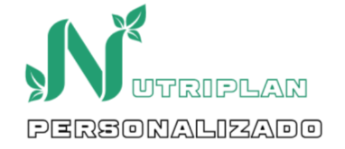

# 🍃 NutriPlan Personalizado

## 👥 Grupo
**LOS_TELETUBBIES**

## 📧 Integrantes y Contacto
- Nicole Ariadna Celemin Triana – [@nicole1ariadna](https://github.com/nicole1ariadna)  
- Yeiner Arwawingumu Zapata Vallejo – [@ARWAWINGUMU](https://github.com/ARWAWINGUMU)  
- Deiber David Gongora Hurtado – [@DeiberD](https://github.com/DeiberD)  
- Camilo Andres Beltran Zabala – [@cxbeltzz](https://github.com/cxbeltzz)  

## 📖 Descripción del Proyecto
**NutriPlan Personalizado: Sistema Inteligente de Planificación Nutricional**  

NutriPlan es una aplicación web diseñada para generar **planes nutricionales personalizados** basados en las características individuales y objetivos de salud de cada usuario.  

Con un sistema de registro seguro, perfiles personalizados, algoritmos de cálculo nutricional y un motor de recomendación basado en **K-Nearest Neighbors (KNN)**, la plataforma ofrece planes adaptados que consideran datos biométricos, nivel de actividad física, preferencias alimentarias y restricciones dietéticas.  

### ✨ Características principales
- Registro y autenticación de usuarios con verificación por correo electrónico.  
- Perfil personalizado con datos biométricos, objetivos y restricciones.  
- Calculadora de **IMC** y **metabolismo basal**.  
- Algoritmo de **recomendación KNN** para planes adaptados.  
- Generación de planes de comidas semanales con variedad.  
- Seguimiento del progreso mediante gráficas e historial.  
- Exportación de planes y reportes en **PDF/CSV**.  

### 🛠️ Tecnologías consideradas
- **Frontend:** HTML, CSS, JavaScript  
- **Backend:** PHP / Python / Node.js  
- **Base de datos:** Relacional (usuarios y alimentos)  
- **Visualizaciones:** Chart.js  

---

🚀 Proyecto en desarrollo (3 meses de alcance inicial).  
